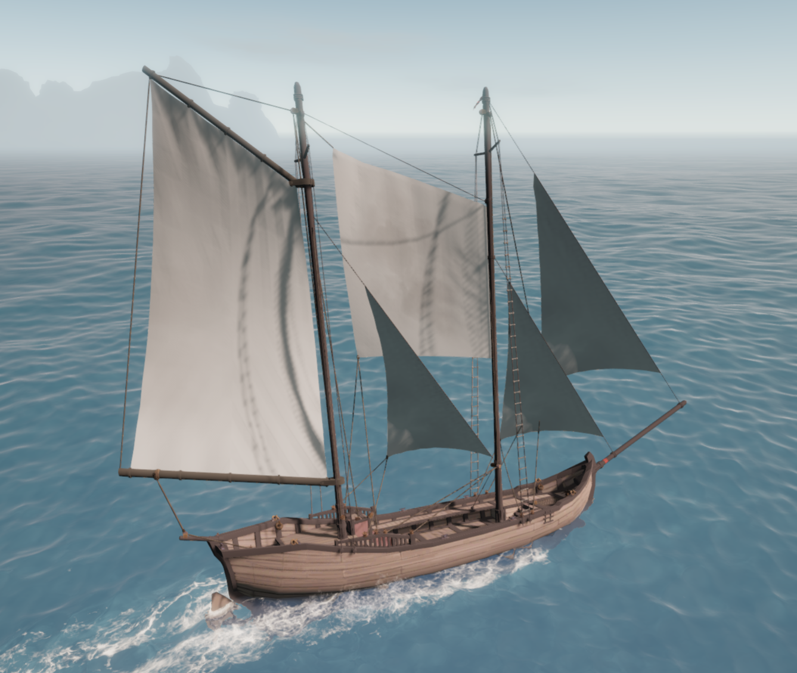
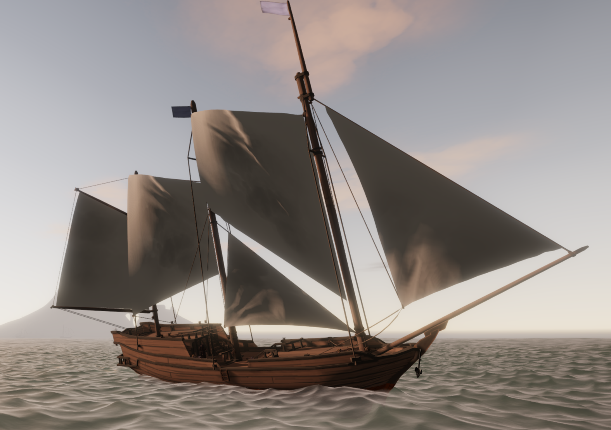
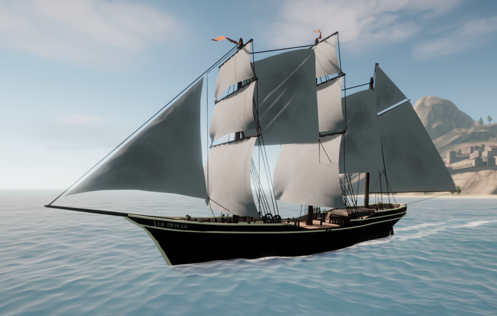
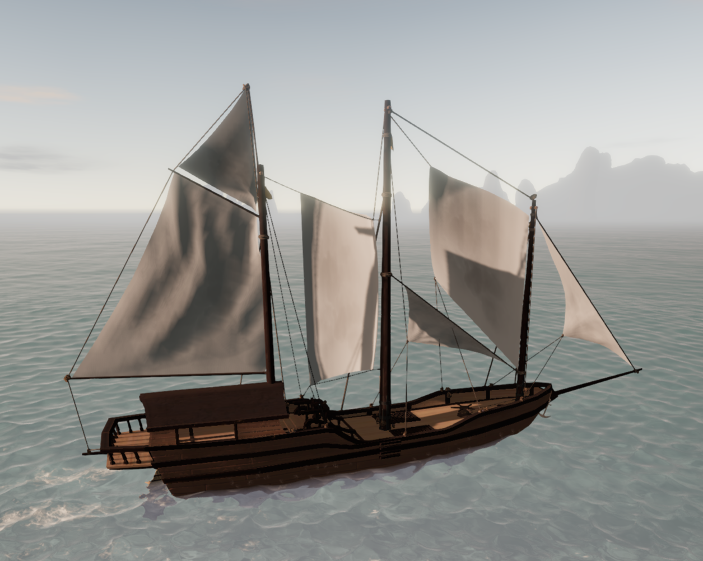
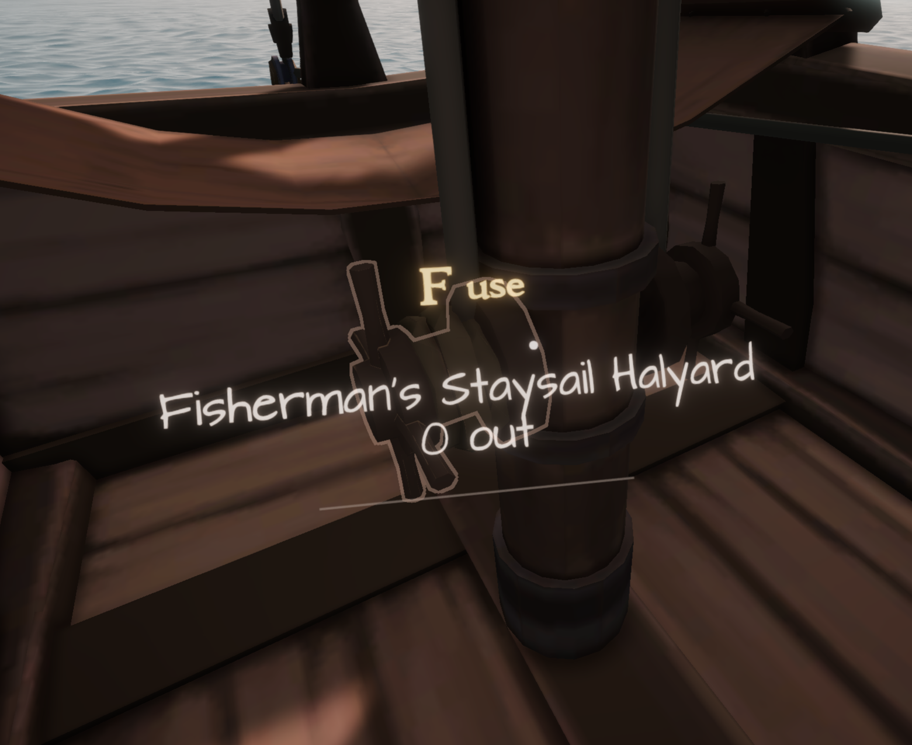
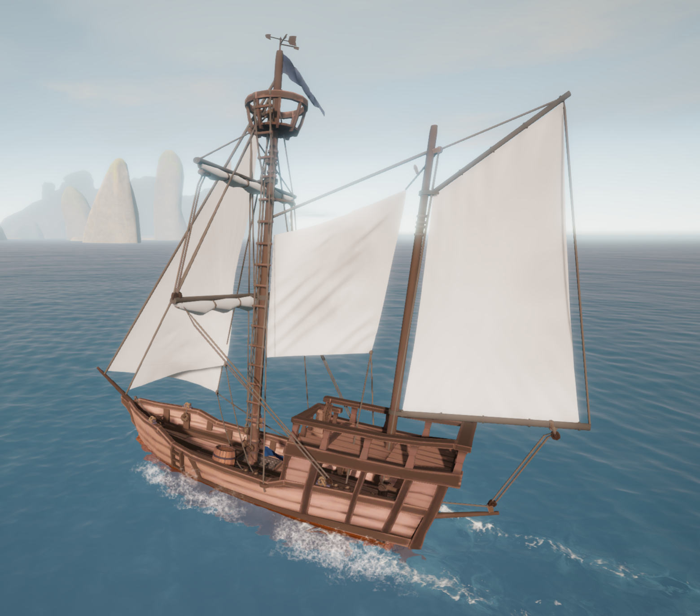

# MoreSailwindSails

<!-- prettier-ignore -->
> [!IMPORTANT]
> This README documents the current development version of MoreSailwindSails.
>
> For documentation on the latest stable version, see the [0.2.2 tagged release](https://github.com/sum-rock/MoreSailwindSails/tree/v0.2.2).
>
> To download the latest release go to the [release page](https://github.com/sum-rock/MoreSailwindSails/releases)

## Overview

MoreSailwindSails adds new sail types to Sailwind, with room for more as they
are developed. The mod currently includes two sail families:

- **Fisherman's Staysails** — Mk.A, Mk.B and Mk.C cuts fitted to a Fisherman's
  Stay between two masts.
- **Fisherman's Flying Sails** — sails fitted directly to a physical mast, with
  an active mast behind it for support.

**Fisherman's Stays** provide the rigging mounts for the staysail family.

### Current versions

**Latest release:** 0.2.2\
**Development:** 0.3.0-dev

See the [changelog](#changelog).

  
  
  
   
  
  
  

Select a screenshot to view it at full size.

### What's included

| Sail or rigging               | What it adds                                                                                                                                |
| ----------------------------- | ------------------------------------------------------------------------------------------------------------------------------------------- |
| **Fisherman's Stay**          | A high stay between two masts, with variants for supported mast and topmast combinations.                                                   |
| **Fisherman's Staysail Mk.A** | A four-corner sail with a sloping head and a lower edge that slopes downward toward the aft mast.                                           |
| **Fisherman's Staysail Mk.B** | The same head and controls as Mk.A, with a straight lower edge perpendicular to the mast—level with the deck on upright masts.              |
| **Fisherman's Staysail Mk.C** | The same head and controls, with a 50% longer luff and a lower edge rising 40° from the forward luff toward the aft leech on upright masts. |
| **Fisherman's Flying Sail**   | A separate sail fitted directly to a mast through the **Other** category.                                                                   |

Supported boats: **Brig, Junk, Jong, Sanbuq, Cog, Shroud and Baghala**. Shroud
requires
[Shattered Seas Expansion](https://github.com/TheOriginOfAllEvil/Shattered-Seas-Expansion).
Available stay variants depend on the boat and its fitted masts.

**Leopard support has been removed.** Future compatibility work is tracked in
[issue #33](https://github.com/sum-rock/MoreSailwindSails/issues/33).

## Usage

### Fitting a staysail

1. Open the shipyard's **rigging parts** and select **Fisherman's Stay** for the
   mast pair you want to use.
2. Choose the variant matching your fitted masts and topmasts.
3. Select that stay in the sail-fitting controls, open **Staysails**, and choose
   **Fisherman's Staysail Mk.A**, **Mk.B** or **Mk.C**.
4. Resize and position the sail with the normal shipyard controls, leaving
   clearance from the deck, aft mast and other rigging.
5. Complete the shipyard order.

**Mk.A, Mk.B and Mk.C fit only on Fisherman's Stays.** Each stay carries one
sail; these stays can also carry vanilla staysails. Supported three-masted boats
offer additional mast pairs.

All three cuts start with the same width; Mk.C has a luff 50% longer than Mk.A
and Mk.B and needs more room on the forward mast. They can be resized uniformly.
New sails are white and plain, with normal recoloring available. Heads follow
the fitted stay; foot cuts use the forward mast’s frame and tilt with mast rake.

Remove a fitted sail before replacing or removing its stay. If you change a
supporting mast or add a topmast, choose a matching stay variant as part of the
shipyard changes.

### Using the Flying Sail

At a shipyard, select a **physical mast**, open **Other**, and choose
**Fisherman's Flying Sail**. It needs a supported active mast behind it.

Its own hoist winch raises it from the deck, and its port and starboard sheets
control the trim. Fully lowering it hides the sail.

## Requirements and installation

**Use at your own risk.** This mod is provided as-is, without warranty. I am not
responsible for damage, data loss, or other issues affecting your computer,
game, or save files from using this mod. Back up your saves before installing.

- Built against **Sailwind 0.39**
- **BepInEx 5**
- **Shipyard Expansion 0.12.1** (required)

1. Close Sailwind.
2. Place `MoreSailwindSails.dll` in
   `<Sailwind>/BepInEx/plugins/MoreSailwindSails/`, creating the folder if
   needed.
3. When updating, replace the old DLL and remove any duplicate copies.
4. Launch the game and visit a shipyard.

## Removing the mod

Before uninstalling, remove all sails and rigging added by MoreSailwindSails
(currently the Fisherman's sails and stays), then save your game. Remove fitted
sails before removing the stays or masts that support them.

## Changelog

### 0.2.2

- Updated texture integration for **Shipyard Expansion 0.12.1**, fixing the
  missing-field exception that interrupted game loading.
- Requires **Shipyard Expansion 0.12.1**.

### 0.2.1

- **Completely reworked sheeting winch and halyard winch placement** for much
  more reasonable and consistent locations, using available native mounting
  points and respecting existing winch use.
- Fixed Fisherman's sail compatibility with **Shroud** from
  [Shattered Seas Expansion](https://github.com/TheOriginOfAllEvil/Shattered-Seas-Expansion),
  including sheet placement and halyard placement on its belaying pins.
- Added **SailInfo hover labels** identifying Fisherman's Flying Sails and
  Staysails when hovering over their sheet and halyard controls.
- Fixed missing halyard placements on both **Cog** mizzen variants by using
  available associated stay winches when the mast's own winch is occupied.
- Corrected floating or tilted **Fisherman's Stay collars** on **Sanbuq** and
  **Baghala**, fitting the collars around their supporting masts.
- Fixed missing **Flying Sail corner knots**.
- Added an optional **winch mounting-point overlay** to help inspect occupied
  and available locations. It is disabled by default; see the
  [diagnostic instructions](docs/DEVELOPMENT.md#viewing-winch-mounting-points).
- Removed **Leopard support** pending further compatibility work.

### 0.2.0

- **Staysail Mk.C**, with a longer luff and a foot rising toward the aft mast.
- A smaller **Flying Sail** with a trapezoid cut, fixed mast ties, rounded
  billow, revised control ropes and corner knots.
- Corrected sheet-winch placement along measured rails and other solid supports.
- Support for new Baghala and a fix for custom sail sound initialization.

For building the mod, technical details and testing notes, see the
[development guide](docs/DEVELOPMENT.md).
